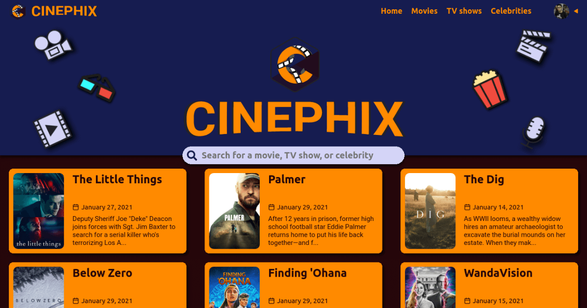

# Cinephix

Cinephix is an application made for cinephiles, where people passionate about movies and TV shows can pursue their interest.

This is the main front-end application of it, which is available at [cinephix.com](https://cinephix.com).

## Features

- Search and discover movies, TV shows, and celebrities
- Save and organize movies and TV shows
  - Status
  - Venue
  - Ratings
- Create predictions groups

## Technologies

- [JavaScript](https://www.javascript.com)
- [TypeScript](https://www.typescriptlang.org)
- [React.js](https://reactjs.org)
- [Next.js](https://nextjs.org)
- [Styled Components](https://styled-components.com)
- [SweetAlert2](https://sweetalert2.github.io)
  > Popup boxes
- [SWR](https://swr.vercel.app)
  > React Hooks library for data fetching
- [Framer Motion](https://www.framer.com/motion/)
  > Motion library for React
- [RBD](https://react-beautiful-dnd.netlify.app/)
  > Drag and drop library
- [Swiper](https://swiperjs.com)
  > Touch slider

## Associated repositories

- [cinephix-server](https://github.com/iago-mendes/cinephix-server)
  > API
- [cinephix-links](https://github.com/iago-mendes/cinephix-links)
  > Redirect setup for links
